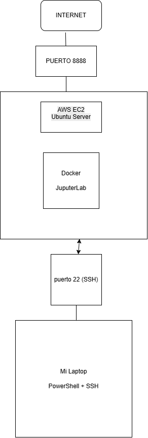

# AWS EC2 JupyterLab Lab

Cloud infrastructure laboratory focused on deploying and documenting a containerized JupyterLab environment on Amazon Web Services.

The project demonstrates the use of Amazon EC2, Ubuntu Server, SSH remote administration, Docker containerization, AWS Security Groups, and JupyterLab service exposure through TCP port 8888.

## Architecture



The environment follows this logical flow:

```text
Local Windows Workstation
        |
   PowerShell + SSH
        |
     TCP 22
        |
AWS Security Group
        |
     AWS EC2
   Ubuntu Server
        |
      Docker
        |
    JupyterLab
        |
     TCP 8888
        |
 Internet / Web Client
