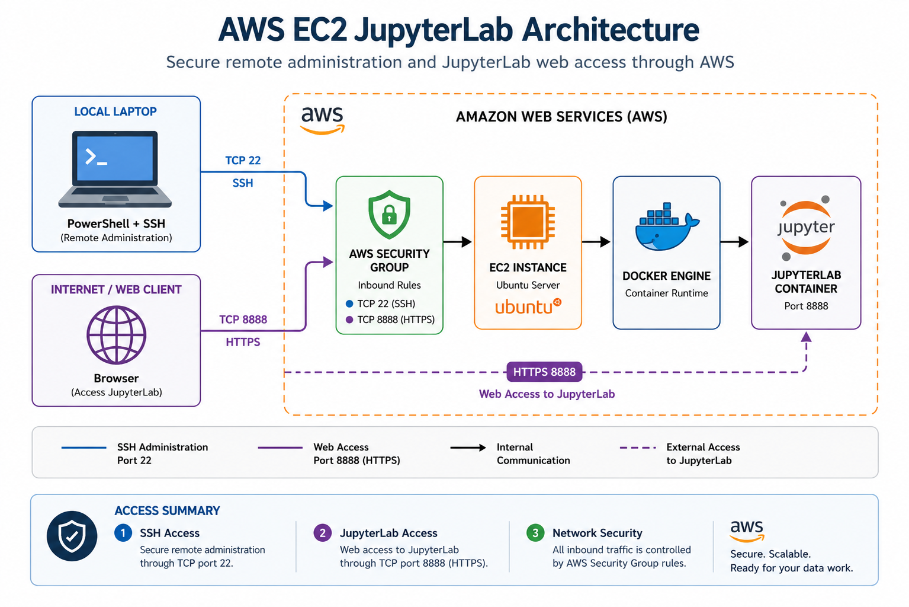

# AWS EC2 JupyterLab Lab

Cloud infrastructure laboratory focused on deploying and documenting a containerized JupyterLab environment on Amazon Web Services.

The project demonstrates the use of Amazon EC2, Ubuntu Server, SSH remote administration, Docker containerization, AWS Security Groups, and JupyterLab service exposure through TCP port 8888.

## Architecture



This architecture highlights two controlled access paths:

- SSH administration through TCP port 22.
- JupyterLab web access through TCP port 8888.

The workload is hosted on an Ubuntu Server EC2 instance, with JupyterLab running inside a Docker container and inbound traffic controlled through an AWS Security Group.

## Technologies

- Amazon Web Services (AWS)
- Amazon EC2
- Ubuntu Server
- Docker
- JupyterLab
- SSH
- PowerShell
- AWS Security Groups
- Linux CLI

## Project Workflow

### 1. EC2 Provisioning

An Ubuntu Server instance was provisioned using Amazon EC2 as the cloud host for the laboratory environment.

### 2. Remote Administration

The EC2 instance was accessed remotely from a Windows workstation using PowerShell and SSH authentication.

Example connection format:

```bash
ssh -i private-key.pem ubuntu@EC2_PUBLIC_IP
```

Private key material and active infrastructure addresses are intentionally excluded from this public repository.

### 3. System Preparation

The Ubuntu operating system was updated before additional services were installed.

```bash
sudo apt update
sudo apt upgrade -y
```

### 4. Docker Deployment

Docker provided the container runtime used for the JupyterLab environment.

```bash
sudo apt install docker.io -y
```

Running containers can be inspected using:

```bash
docker ps
```

### 5. Network Security

AWS Security Groups were used to control inbound network traffic to the EC2 instance.

| Service | Protocol | Port | Purpose |
|---|---|---:|---|
| SSH | TCP | 22 | Remote server administration |
| JupyterLab | TCP | 8888 | Web access to the JupyterLab service |

## Security Considerations

Sensitive operational information is intentionally excluded from this repository, including:

- AWS private keys
- `.pem` files
- Passwords
- Jupyter authentication tokens
- AWS credentials
- Active public IP addresses

The repository contains only documentation, architecture, and selected non-sensitive technical evidence.

## Technical Evidence

Selected evidence is available in the [`evidence/`](evidence/) directory.

Currently included:

- successful authenticated access to the Ubuntu EC2 instance;
- Linux filesystem and storage validation using `df -h`;
- architecture documentation for the AWS environment.

Only evidence that can be clearly associated with this laboratory is published.

## Documentation

Additional documentation is organized by technical area:

- [Architecture](architecture/)
- [Deployment](deployment/)
- [Docker and JupyterLab](docker/)
- [Security](security/)
- [Technical Evidence](evidence/)

## Repository Structure

```text
aws-ec2-jupyterlab-lab/
│
├── README.md
│
├── architecture/
│   ├── README.md
│   └── aws-ec2-jupyterlab-architecture.png
│
├── deployment/
│   └── README.md
│
├── docker/
│   └── README.md
│
├── security/
│   └── README.md
│
└── evidence/
    ├── README.md
    ├── aws-ec2-ssh-session.png
    └── aws-ec2-disk-usage-df-h.png
```

## Skills Demonstrated

This laboratory demonstrates practical experience with:

- Cloud infrastructure provisioning
- Linux server administration
- SSH remote access
- Docker containerization
- Network port configuration
- AWS Security Groups
- Basic cloud security practices
- Infrastructure documentation

## Project Context

This laboratory was completed as part of academic hands-on work involving operating systems, cloud infrastructure, networking, containerization, and data-oriented environments.

It forms part of a broader technical portfolio documenting practical experience with infrastructure, system administration, networking, and Big Data technologies.
